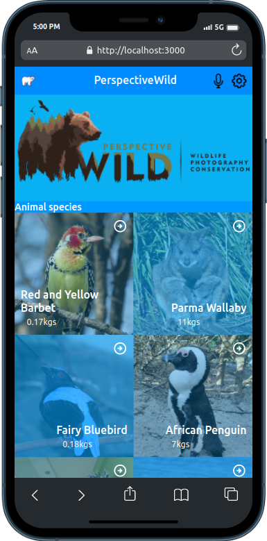

# PerspectiveWild

> This is a react project that showcase the different types of animals both wild and domesticated. The project aims to shade light on the need to preserved the different species of animals and at the same time share facts curated for specific animals species. checkout the demo site [here]()

.png)
## Build with

- [x] React
- [x] Redux
- [x] Thunk
- [x] Redux-Logger
- [x] Vanilla JavaScript
- [x] CSS
- [x] HTML
- [x] react-bootstrap

## Getting Started

### Prerequisites

You need to have a browser and this tools installed:

- git
- Node

### Setup

To get a local copy up and running follow these simple example steps:

```
$ git clone https://github.com/daudi13/seafood

```

```
$ cd seafood
```

```
$ npm i
```

```
$ npm start
```

### Usage

To build the production version:

```
$ npm run build
```

## Author
👤 **David Ouma**

- GitHub: [@daudi13](https://github.com/daudi13)
- Twitter: [@davouma](https://twitter.com/davouma)
- LinkedIn: [David Ouma](https://www.linkedin.com/in/david-ouma-3a3539179/)

## 🤝 Contributing

Contributions, issues, and feature requests are welcome!

Feel free to check the [issues page](../../issues/).

## Show your support

Give a ⭐️ if you like this project!

## 📝 License

This project is [GPL-3.0](./LICENSE) licensed.
